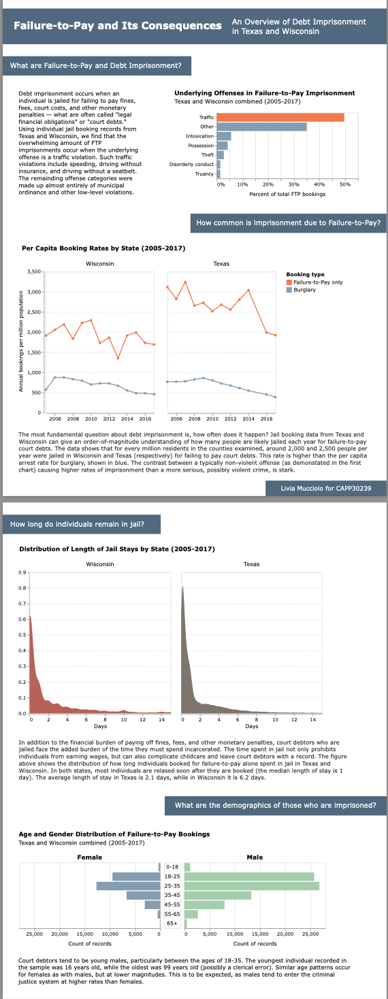

# Failure-to-Pay and Its Consequences: An Overview of Debt Imprisonment in Texas and Wisconsin
### By: Livia Mucciolo

CAPP 30239: Data Visualization for Policy Analysis

## Description
While debtors' prison for private debts is illegal, imprisonment for failure to pay fines, fees, or court debts is commonplace across many states. Often, the debt is not from criminal charges but from traffic and other non-criminal violations. High-profile investigations in Missouri and Mississippi over the last decade have uncovered the frequency with which courts imprison court debtors, with little to no regard for their ability to pay. These practices often serve as monetary punishment for the poor, who have the most to lose from being imprisoned.

In this project, I use individual jail booking data from 2005 to 2017 from Texas and Wisconsin to examine the incidence of debt imprisonment in those states and how it has changed over time across different demographics. I show that Failure-to-Pay imprisonment affects at least tens of thousands of people per year and has significant consequences for people caught up in it.

## Screenshot Sample

## Data Sources
The data used primarily comes from Gaebler JD, Barghouty P, Vicol S, Phillips C, Goel S (2023) Forgotten but not gone: A multi-state analysis of modern-day debt imprisonment. PLoS ONE 18(9): e0290397. The authors of the paper provide data used in their paper on their [website](https://policylab.hks.harvard.edu/debtors-prisons/data/). To get CSV's, I followed instructions on their corresponding [GitHub repository](https://policylab.hks.harvard.edu/debtors-prisons/data/). Specifically, I used the 'Bulk Data Downloads' instructions to download the raw data and 'Reproduction' script to reproduce the following dataframes:

- d_tx_all_ftp (excluded due to size limits)
- d_wi_all_ftp (excluded due to size limits)
- pop_tx (included as acs_tx.csv)
- pop_wi (included as acs_wi.csv)
- burglary (included as burglary.csv)

## Acknowledgements

Thank you to the course staff and classmates for their valuable feedback.
