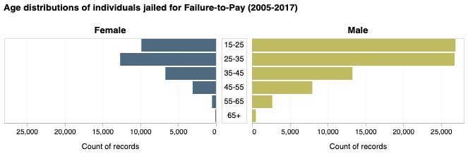

# Failure to Pay and Its Consequences: An Overview of Debt Imprisonment in Texas and Wisconsin

Livia Mucciolo

## What is your current goal? Has it changed since the proposal?

## Are there data challenges you are facing? Are you currently depending on mock data?
Some of my original data is too large to store on GitHub. I will need to figure out a way to minimize it or
find another place to made it readily accessible. Another challenge I am facing is that I do not 
have much quantitative data. That is making it difficult to think of what to show
on my maps (especially when not all counties have data).

## Describe each of the provided images with 2-3 sentences to give the context and how it relates to your goal.

### Image 1

This line chart ...
### Image 2

This bar plot ...
### Image 3

This density plot ...

(Alternatives are shown below.)
### Image 4

### Image 5

### Image 6

### Image 7

### Image 8

This population pyramid shows how many females and males that were jailed for only
failure-to-pay are in the dataset by age groups. I would like the viewer to take
away that mostly men are imprisoned for failure-to-pay and that imprisonment affects
younger individuals. These findings are to be expected, but it is nice to contextualize
the numbers, especially separated by gender. Note: these counts include data from 
2005-2017.

## What form do you envision your final deliverable taking? (An article incorporating the images? A poster? An infographic?)
I envision my final deliverable to either be an article incorporating the images or an infographic. I am leaning towards the latter as I feel it would add novelty, since my data is coming from a published research article already.
