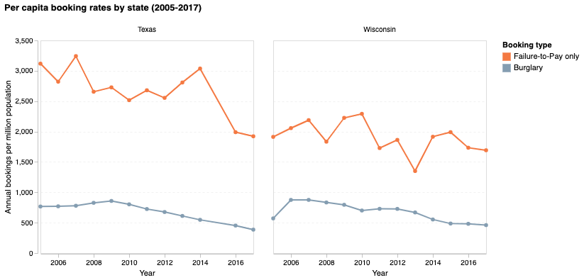
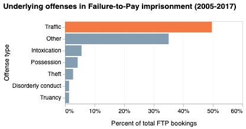
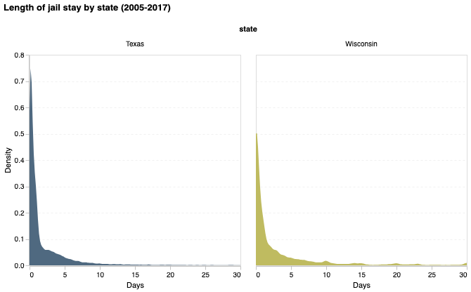
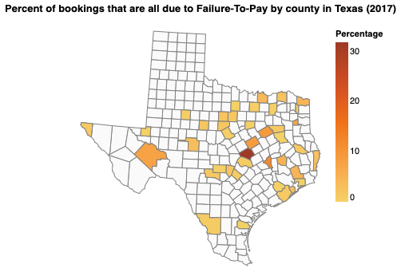
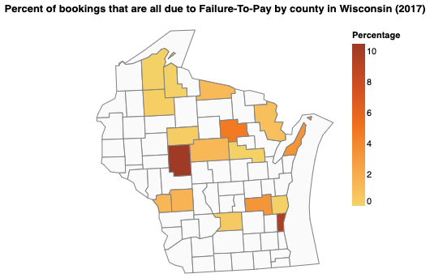
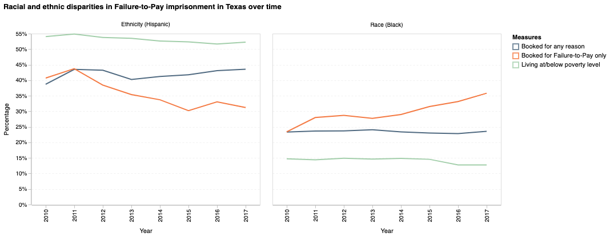

# Failure to Pay and Its Consequences: An Overview of Debt Imprisonment in Texas and Wisconsin

Livia Mucciolo

## What is your current goal? Has it changed since the proposal?
My current goal has not changed since the proposal. It has remained to show the 
incidence of debt imprisonment in Texas and Wisconsin across 2005-2017, and 
to build upon the research "Forgotten but not gone: A multi-state analysis of 
modern-day debt imprisonment" paper ([Github](https://github.com/stanford-policylab/debt),
[website](https://policylab.hks.harvard.edu/debtors-prisons/)). I specifically
want to highlight disparities among minorities, and to provide more demographic
context to the already collected data.

## Are there data challenges you are facing? Are you currently depending on mock data?
Some of my original data is too large to store on GitHub. I will need to figure out a way to minimize it or
find another place to made it readily accessible. Another challenge I am facing is that I do not 
have much quantitative data. That is making it difficult to think of what to show
on my maps (especially when not all counties have data).

## Describe each of the provided images with 2-3 sentences to give the context and how it relates to your goal.

### Image 1

This line chart shows that the per capita failure to pay jail bookings (per million
population) are much higher than that of burglary bookings. The key point here is
that failure to pay imprisonment is much more common than imprisonment for other
(and more well known) criminal offenses such as burglary. It also shows that the
trend has dropped only slightly over time across both states. 

### Image 2

This bar plot breakdowns the underlying offenses that contribute to failure-to-pay
imprisonments. The overwhelming majority of failure-to-pay bookings are for 
petty and non-criminal offenses. What I want to focus on is that something as 
trivial as a traffic offense can lead to jail time for individuals who do not
have the funds to pay the necessary fines and fees. 

### Image 3

This density plot illustrates the concentration of jail time due to failure-to-pay
charges. Across both Texas and Wisconsin the majority of cases spend 0-5 days in 
jail. A day may not sounds like a long time, but it can have strong consequences for
individuals. Loss of wages, childcare, and the additional costs of entering the 
judicial system can have lasting negative effects on people.

### Image 4

This map was intended to show the percent of bookings in 2017 due to failure-to-pay
across counties in Texas. I've run into an issue that not all counties have sufficient
data though. I am open to new suggestions on what would be other useful measures
to include at a county level. 

### Image 5

This map was intended to show the percent of bookings in 2017 due to failure-to-pay
across counties in Wisconsin. Similar to image 4, I do not have enough counties
the dataset to make a compelling narrative about trends across the state.

### Image 6

This image has two plots two show trends in race and ethnicity disparities in 
failure-to-pay jailings in Texas. We see that Black individuals are overrepresented
in FTP bookings relative to their share of the population living under the poverty
level. On the other hand, Hispanic individuals are underrepresented.

### Image 7

This image has two plots two show trends in race and ethnicity disparities in 
failure-to-pay jailings in Wisconsin. We see that Black individuals are overrepresented
in FTP bookings relative to their share of the population living under the poverty
level. Also noteworthy, the percentage booked for FTP only almost doubled
within that population between 2010 and 2017. On the other hand, Hispanic 
individuals are underrepresented. These findings are similar to those we saw in 
image 6 for Texas.

### Image 8

This population pyramid shows how many females and males that were jailed for only
failure-to-pay are in the dataset by age groups. I would like the viewer to take
away that mostly men are imprisoned for failure-to-pay and that imprisonment affects
younger individuals. These findings are to be expected, but it is nice to contextualize
the numbers, especially separated by gender.

## What form do you envision your final deliverable taking? (An article incorporating the images? A poster? An infographic?)
I envision my final deliverable to either be an article incorporating the images or an infographic. I am leaning towards the latter as I feel it would add novelty, since my data is coming from a published research article already.
